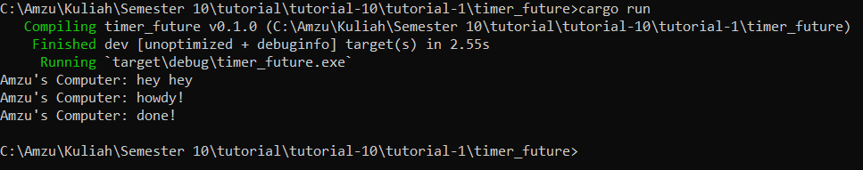

# Tutorial 10
Tutorial 1: Timer
This tutorial is based on this part of the book:
https://rust-lang.github.io/async-book/02_execution/04_executor.html

## 1.2 Understanding how it works

After adding the line `println!("Amzu's Computer: hey hey")` to the code, it displays the "hey hey" line first before anything else. Lets break it down then.. So in the program, a task is spawned using `spawner.spawn(async {...})`. This task consists of asynchronous code to print "howdy!" and then waits for the timer future to complete. However, the task is not executed immediately, it is queued for execution by the executor.

After spawning the task, the synchronous code in `main` function continues to execute, therefore it prints "hey hey" to the console. And then then the line `drop(spawner)` is executed, indicates to the executor that no more tasks will be added to the queue. So it runs the `executor.run()`. It executes the spawned task to prints "howdy!" and waits for the timer future to complete. Once the timer future completes after the specified duration, the task prints "done!". Basically, "hey hey" is printed synchonously before any of the asynchronous tasks are executed because it's part of the main function's execution workflow.
